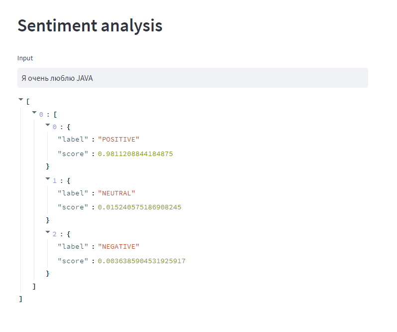

# bert_serve

Streamlit demo for HuggingFace Sentiment analysis

# Requirements

spacy>=2.3.2

streamlit>=0.62.1

transformers>=3.1.0

httpx>=0.15.3 

seaborn>=0.10.1

torch-model-archiver

torchserve

streamlit

# Quickstart

1) Copy repository

2) Choose preferred model

3) download to my-finetuned-bert

4) run torchserve

5) run streamlit web interface
